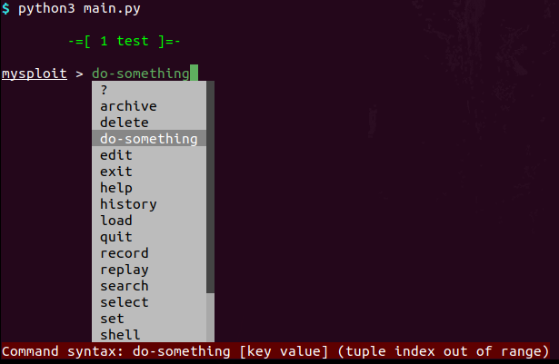

## Introduction

Sploitkit is a framework designed to quickly build CLI consoles with a style ressembling that of Metasploit. It features a clear and intuitive plugin architecture that allows to build consoles with new commands or modules but also models for their internal stores. This is another framework made according to the DRY philosophy.

The idea is to make creating consoles as easy as this:

```sh
$ sploitkit-new my-sploit
$ cd my-sploit
$ gedit main.py
```

```python
#!/usr/bin/python3
from sploitkit import FrameworkConsole


class MySploitConsole(FrameworkConsole):
    # set your console items here
    pass


if __name__ == '__main__':
    MySploitConsole(
        "MySploit",
        # configure your console settings here
    ).start()
```

This will give the following (no banner, ASCII image or quote yet):



-----

## Rationale

This library is born from the need of quickly building toolsets tailored to various scopes which are sometimes not extensively covered in some well-known frameworks (like Metasploit).

It relies on the awesome Python library [`prompt_toolkit`](https://github.com/prompt-toolkit/python-prompt-toolkit) to provide an enhanced CLI environment, adding multiple graphical elements (e.g. dropdown lists for completion and a dynamic toolbar for displaying command syntax errors) greatly improving user's experience regarding some classical tools (like e.g. or also [`rpl-attacks`](https://github.com/dhondta/rpl-attacks) or [`recon-ng`](https://github.com/lanmaster53/recon-ng), which have some limits on the usability point of view because of the [`cmd` module](https://docs.python.org/3/library/cmd.html)).

In the meantime, I personnally used this library a few times to create CLI consoles for my job or during cybersecurity engagements or programming competitions and it proved very useful and convenient.
